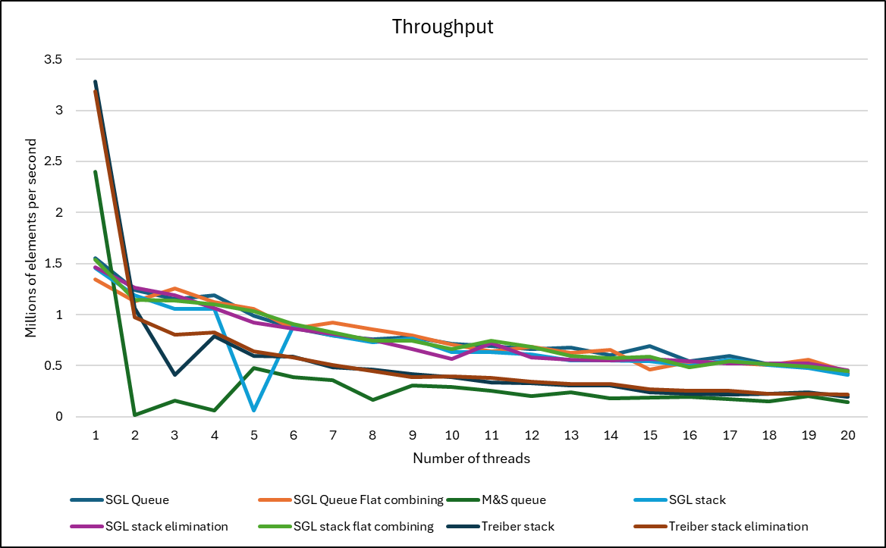

# Final project Write-Up

## Experement Results
By running the autograder script mentioned under the Execution instruction section and analysing the resultant excel sheet, I have generated this graph that measures throughput for each data structure with increasing number of thereads to insert 1000000 elements into the data structure

From this graph, we can see that Treiber stack performs very well for single thread operations and drops very significantly for multithread operations. The trend follows for M&S queue as well. All other data structures perform fairly consistently w.r.t each other and slowely dips down with increase in number of therads. 

The occational dips in the graph is the occational result of the test failing and it can be discarded.
## Code Organization
Code is written in Cpp and the `main` file hold the code to parse cli, launch threads, insert/remove elemments from the given data structure and dump the output from the remove operation into the given output file. `containers.cpp` and `containers.hpp` contains the following data structure implementations: `--alg=sgl_queue` `--alg=sgl_queue_flat` `--alg=ms` `--alg=sgl_stack` `--alg=sgl_stack_elem` `--alg=sgl_stack_flat` `--alg=treiber` `--alg=treiber_elem`

---

## Files Submitted and Description
### containers.cpp
- Contains the class implementations for all mentioned data structures

### containers.hpp
- Contains the class definitions for all mentioned data structures

### main.cpp
- Contains the main function which tests all data structures based on number of elements to insert, data structure to use, number of threads to use that is given via command line and saving output to the given text file.
- Implements the following logic:
	- Parsing through command line arguments, validating them, and saving the required info.
	- Printing error messages if the programs recieves any inncorrect input from the command line.
	- Calling the data structure algorithms with the approporiate number of elements to insert and number of threads to use based on command line input.
	- output data from data structure is saved in the given output file name.

---

## Compilation Instructions
The code can be compiled using `make` command. This program is compiled using `g++-11`	and using the flags `-pthread -O3 --std=c++2a -g` to create the executable `containers`. `make clean` can be used to clean the generate `.o` files as well.

---

## Execution Instructions
The program can be run using the `./containers` command. Program can be run as follows:

`containers [-h] [-t NUM_THREADS] [-n NUM] [--alg=<sgl_queue, sgl_queue_flat, sgl_stack, sgl_stack_elem, sgl_stack_flat, treiber, treiber_elem, ms>] [-o out.txt]`

The program launches `NUM_THREADS` and equally divides `NUM` among each thread and first enqueues it to the selected data structure in the `--alg=` flag, then dequeues it and pushes it to the given output file in `out.txt`.

The given `./autograde` shell script can also be used to quickly test this program. This shell script shall run all the given algorithms with 4 threads and provide the following `NUM` input in seperate runs: 100, 500, 1000, 5000, and 10000. The output from all these runs would be saved, compared against expected results and print PASS/FAIL in the console as needed.

If given `-a` flag in the `./autograde` shell script, the script shall run a performance analysis for the program where it shall measure the time take for the program to run, and elements throughput by giving 1000000 elements to insert in all mentioned data structures using `NUM_THREAD` that varies from 1-20 threads and provide the results in the `test_results.csv` file which can be used for analysis later on.

---

## Extant Bugs
Based on multiple runs, I found that my push/pop or enqueue/dequeue operation fails about 5% of the time it is run for inserting 100, 500, 1000, 5000, and 10000 elements no matter the number of threads used. I also found that my program also fails quite a bit

---

## Perf Analysis

The perf analysis for each data structure is given in this table which is tested by inserting 10000 elements into the respective data structure with given 4 threads

| Algorithm                     | Runtime (s) | L1 cache hit (%) | Branch Pred Hit Rate (%) | Page Fault Count (#) |
|-------------------------------|-------------|------------------|--------------------------|----------------------|
| SGL Queue                     | 0.008287    | 3.71             | 1.71                     | 217                  |
| SGL Queue flat-combining      | 0.004168    | 3.81             | 1.8                      | 214                  |
| SGL stack                     | 0.008558    | 3.42             | 1.6                      | 212                  |
| SGL stack elimination         | 0.017881    | 3.77             | 1.68                     | 213                  |
| SGL stack flat-combining      | 0.006831    | 3.45             | 1.57                     | 212                  |
| M&S queue                     | 0.006478    | 6.66             | 2.57                     | 441                  |
| Treiber stack                 | 0.015611    | 4.3              | 1.95                     | 514                  |
| Treiber stack elimination     | 0.020764    | 4.32             | 2                        | 516                  |

---

## Appendix

The throughput for each data structure is given in this table which is tested by inserting 1000000 elements into the respective data structure with given number of threads

| Threads | SGL Queue | SGL Queue Flat combining | M&S queue | SGL stack | SGL stack elimination   | SGL stack flat combining  | Treiber stack | Treiber stack elimination |
|---------|-----------|--------------------------|-----------|-----------|--------------------------|---------------------------|---------------|----------------------------|
| 1       | 1.55461   | 1.3431                   | 2.4017    | 1.45957   | 1.46527                 | 1.53828                  | 3.28149       | 3.18211                    |
| 2       | 1.24392   | 1.12972                  | 0.02011   | 1.19227   | 1.26262                 | 1.14217                  | 1.0659        | 0.97133                    |
| 3       | 1.14937   | 1.25479                  | 0.1576    | 1.05805   | 1.19203                 | 1.13947                  | 0.40882       | 0.80293                    |
| 4       | 1.19166   | 1.12188                  | 0.06382   | 1.05424   | 1.06095                 | 1.10157                  | 0.78695       | 0.82636                    |
| 5       | 0.99104   | 1.058                    | 0.47558   | 0.06246   | 0.92507                 | 1.0322                   | 0.59352       | 0.63725                    |
| 6       | 0.87015   | 0.86176                  | 0.3844    | 0.88217   | 0.86155                 | 0.90539                  | 0.59169       | 0.58167                    |
| 7       | 0.79471   | 0.91968                  | 0.35928   | 0.79915   | 0.80809                 | 0.82656                  | 0.48497       | 0.50481                    |
| 8       | 0.75834   | 0.85311                  | 0.16333   | 0.72756   | 0.74796                 | 0.74222                  | 0.46442       | 0.44657                    |
| 9       | 0.78339   | 0.79907                  | 0.30953   | 0.76619   | 0.6615                  | 0.74535                  | 0.42106       | 0.38923                    |
| 10      | 0.71475   | 0.70405                  | 0.29057   | 0.63138   | 0.56746                 | 0.66446                  | 0.38863       | 0.39636                    |
| 11      | 0.69543   | 0.64272                  | 0.25147   | 0.63506   | 0.72007                 | 0.7469                   | 0.33755       | 0.38405                    |
| 12      | 0.66156   | 0.6873                   | 0.20059   | 0.61036   | 0.58442                 | 0.688                    | 0.33034       | 0.34326                    |
| 13      | 0.67515   | 0.62394                  | 0.23863   | 0.55153   | 0.55966                 | 0.59868                  | 0.30892       | 0.32446                    |
| 14      | 0.60146   | 0.65443                  | 0.17736   | 0.55443   | 0.55028                 | 0.57589                  | 0.30489       | 0.31772                    |
| 15      | 0.69554   | 0.46224                  | 0.18553   | 0.54731   | 0.5668                  | 0.58709                  | 0.23801       | 0.27026                    |
| 16      | 0.54563   | 0.53856                  | 0.19322   | 0.49673   | 0.5418                  | 0.48602                  | 0.22641       | 0.25684                    |
| 17      | 0.5991    | 0.53026                  | 0.17476   | 0.55689   | 0.51833                 | 0.54232                  | 0.21831       | 0.25596                    |
| 18      | 0.51651   | 0.50906                  | 0.15198   | 0.50794   | 0.51865                 | 0.51093                  | 0.2266        | 0.22708                    |
| 19      | 0.52875   | 0.55682                  | 0.20106   | 0.47578   | 0.52286                 | 0.49163                  | 0.24107       | 0.22546                    |
| 20      | 0.42653   | 0.4381                   | 0.14084   | 0.40945   | 0.45631                 | 0.44444                  | 0.19815       | 0.21797                    |
